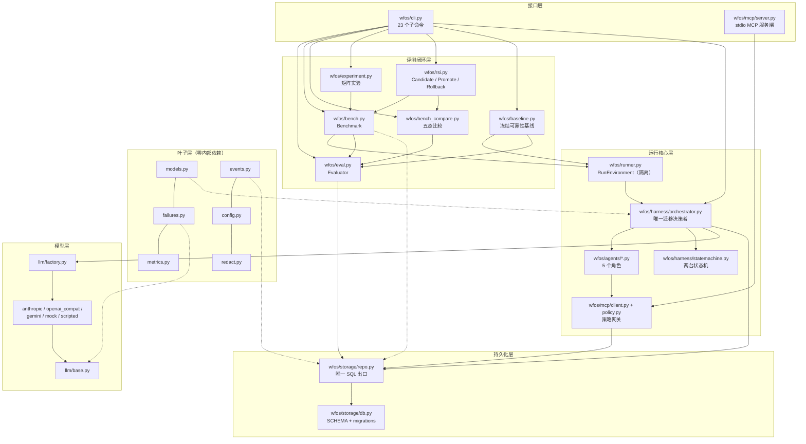
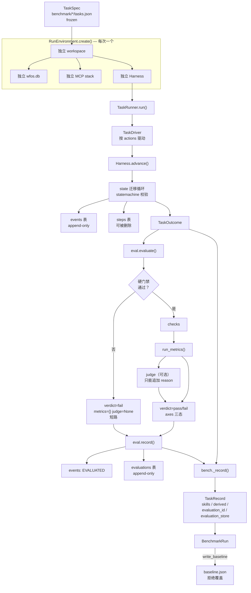
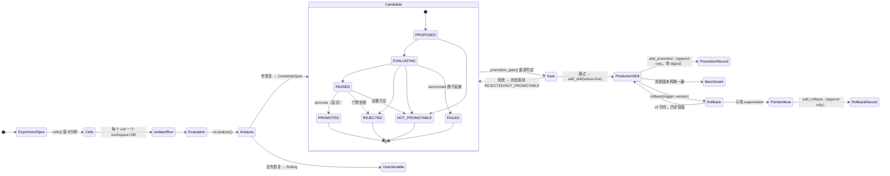
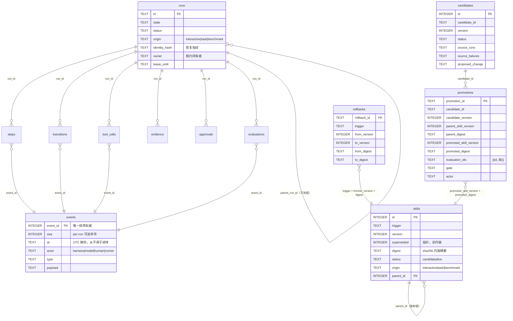

# 架构

> 本文所有内容取自仓库当前代码。文件名、类名、函数名、常量名均可在源码中检索到。
> 凡代码中不存在的能力，一律写「未实现」。

---

## 1. 最终文件架构

```
wfos/                        52 个 .py，13,611 行
├── __init__.py              WFOS — 模型无关的软件工程 Workflow 系统。
├── __main__.py              Entry point: `python -m wfos`.
├── config.py                Configuration loading and dataclasses.
├── models.py                Structured I/O schemas shared by agents, harness and storage.
├── failures.py              The failure vocabularies, in a leaf module.
├── metrics.py               Measured cost of running the workflow: tokens, latency, money.
├── events.py                The append-only trace: what a run did, in the order it did it.
├── redact.py                Secret redaction for content that enters the record from untrusted sources.
├── relevance.py             One notion of "relevant to what this run is working on".
├── tasks.py                 Tasks: what to run, declared rather than implied.
├── runner.py                An isolated place for one run to work.
├── skills.py                Procedures learned from runs that got past a failure, kept as assets.
├── memory.py                Project-level durable memory: what previous runs left behind on these files.
├── eval.py                  Judging a run: what it did, measured against what the task required.
├── bench.py                 Running a benchmark: many tasks, one session, one comparable record.
├── bench_compare.py         Comparing a benchmark record against a baseline.
├── experiment.py            Experiments: many arms of one question, run and recorded together.
├── rsi.py                   RSI: proposing changes from evidence, and finding out whether they help.
├── baseline.py              Frozen reliability baseline: a declarative case set, run and diffed.
├── cli.py                   Command-line interface.
├── harness/
│   ├── orchestrator.py      Harness Orchestrator — the only place that decides state transitions.
│   ├── statemachine.py      Two persistent state machines (Feature dev, Bugfix diagnosis).
│   ├── router.py            Request routing between the Feature and Bugfix machines.
│   ├── identity.py          Resume-time fingerprints: what a persisted step's output was produced under.
│   └── context.py           Context budgeting: assemble an agent prompt under an explicit size budget.
├── agents/
│   ├── base.py              Agent base: every agent declares permissions, then runs with them.
│   ├── investigator.py      只读调查：捕获需求/问题描述、检查项目结构、收集证据。绝不修改任何文件。
│   ├── architect.py         方案设计：制定功能设计/技术方案/根因分析/修复方案。只读，不执行任何写入。
│   ├── implementer.py       代码执行：严格按照 Architect 方案逐文件落地。只做方案里列出的变更。
│   ├── verifier.py          独立验证：执行 build.check / test.run / 回归检查。只读，绝不修改被测代码。
│   └── curator.py           知识沉淀：把本次运行的成功经验蒸馏为知识候选并提交。
├── mcp/
│   ├── server.py            MCP server exposing the WFOS tool suite with policy enforcement.
│   ├── client.py            In-process MCP gateway used by the agent runtime and the mock brain.
│   ├── policy.py            Per-tool policy: roles, path roots, params, timeout, output size, side effects.
│   └── snapshot.py          Workspace snapshot & diff — change attribution the model cannot fake.
├── llm/
│   ├── base.py              Adapter ABC and shared helpers.
│   ├── factory.py           Adapter factory — resolve a provider name to an adapter instance.
│   ├── anthropic.py         Anthropic Messages API adapter.
│   ├── openai_compat.py     OpenAI-compatible chat-completions adapter (OpenAI, vLLM, Ollama /v1, ...).
│   ├── gemini.py            Google Gemini generateContent adapter.
│   ├── mock.py              Deterministic, offline 'mock brain'.
│   ├── scripted.py          Test-only adapter: plays back a scripted sequence of tool-calls / outputs.
│   └── capabilities.py      What a provider turns out to accept, kept in one place.
├── storage/
│   ├── db.py                SQLite connection management and schema.
│   └── repo.py              Repository: typed access to the SQLite database.
└── wiki/
    └── wiki.py              LLM Wiki: three-tier knowledge store + distill pipeline.
```

### 逐文件职责

层：**L**=叶子（不 import 任何本项目模块）·**C**=核心运行 ·**E**=评测闭环 ·**I**=接口层

| 文件 | 层 | 职责 | 输入 | 输出 | 依赖（本项目） | 被谁调用 |
|---|---|---|---|---|---|---|
| `config.py` | L | 配置装载与 dataclass（`LLMConfig`/`HarnessConfig`/`AppConfig`/`SafeCommand`） | `config/*.toml` + 环境变量 | `AppConfig` | — | 5 处，含 `cli`/`runner`/`llm.factory`/`mcp.policy`/`mcp.server` |
| `models.py` | L | 全部 pydantic 结构化 I/O 与常量（`ORIGIN_*`/`SKILL_*`/`PRODUCTION_SKILL_*`/`TERMINAL_STATUSES`） | — | 模型类与常量 | — | **20 处（全仓最多）** |
| `failures.py` | L | 两套失败词表 + `classify_os_error` | 异常对象 | 失败类字符串 | — | `llm.base`、`eval`、`harness.orchestrator` |
| `metrics.py` | L | token/延迟/成本聚合与覆盖率 | repo | `run_metrics()`/`aggregate()` 报告 | — | `eval`、`baseline`、`cli`、`orchestrator` |
| `events.py` | L | append-only trace 的记录与渲染 | repo | `event_id` | — | `bench`、`runner`、`eval`、`rsi`、`orchestrator`、`mcp.client` |
| `redact.py` | L | 密钥脱敏 | 文本/结构 | 脱敏后的文本/结构 | — | `repo`、`wiki` |
| `relevance.py` | L | 单一"相关性"判据 | 路径/关键词 | 布尔或排序 | — | `memory`、`orchestrator` |
| `harness/statemachine.py` | L | 两台状态机的拓扑与合法迁移 | kind | `MACHINES`/`allowed_transitions` | — | `repo`、`tasks`、`orchestrator` |
| `harness/identity.py` | L | 恢复指纹（环境 hash + 关键文件摘要） | cfg + 文件 | `identity_hash` | — | `bench`、`memory`、`orchestrator` |
| `harness/router.py` | L | 请求 → feature/bugfix 的路由 | 自然语言请求 | `kind` | — | `orchestrator` |
| `harness/context.py` | L | 提示词分区预算 | 上下文 dict | 受预算约束的 prompt | — | `orchestrator` |
| `llm/capabilities.py` | L | provider 实测能力记录 | 观测事实 | `Capabilities` | — | `openai_compat`、`orchestrator` |
| `mcp/snapshot.py` | L | 工作区快照与 diff（变更归因） | 目录 | `{路径: 摘要}` | — | `mcp.server` |
| `storage/db.py` | L | SQLite 连接、`SCHEMA`、`_MIGRATIONS` | 路径 | `Connection` | — | `repo`、`bench`、`experiment` |
| `skills.py` | L→C | 从恢复记录蒸馏规程、`content_digest`、`recoveries` | repo + run | skill 行 | `models` | `repo`、`agents.base`、`orchestrator` |
| `llm/base.py` | C | 适配器 ABC、`classify_wire_error`、`is_network_error`、工具名映射 | — | `ModelResult` | `failures`、`models` | 9 处 |
| `llm/factory.py` | C | provider 名 → 适配器实例 | `LLMConfig` | 适配器 | `config` + 5 个适配器 | `orchestrator` |
| `llm/anthropic.py` `openai_compat.py` `gemini.py` `mock.py` `scripted.py` | C | 各 provider 的 wire 适配 | messages/schema/tools | `ModelResult` | `models`、`llm.base` | `llm.factory` |
| `mcp/policy.py` | C | 工具**策略的形状**与错误码：`ToolSpec`（角色/路径根/超时/输出上限/副作用/审批）、`ERROR_CODES`、`SHELL_METACHARS` | — | `ToolSpec` 等 | `config` | `mcp.server`、`mcp.client`、`agents.base` |
| `mcp/server.py` | C | 工具**表**与执行 + 策略强制 + 审计：`WfosMcpServer._build_specs() -> dict[str, ToolSpec]` 是全部工具的注册处 | 工具名 + 参数 | 结构化结果 | `config`、`repo`、`policy`、`snapshot` | `mcp.client`、`cli`、`runner` |
| `mcp/client.py` | C | 进程内网关，带 principal 绑定 | 调用 + principal | 结果 + 审计 | `events`、`models`、`repo`、`policy`、`server` | `agents.base`、`runner`、`orchestrator`、`cli` |
| `storage/repo.py` | C | 全部 SQL 访问（append-only 写入 + 读） | — | dict 行 | `redact`、`statemachine`、`models`、`skills`、`db` | 8 处 |
| `tasks.py` | C | `TaskSpec` 声明与校验、`load_tasks` | tasks.json | `TaskSpec` | `statemachine` | `runner`、`bench`、`experiment`、`baseline` |
| `runner.py` | C | `RunEnvironment`（隔离）/`TaskDriver`/`TaskRunner` | `TaskSpec` + workspace | `TaskOutcome` | `config`、`orchestrator`、`mcp.*`、`repo`、`tasks`、`wiki`、`events` | `bench`、`experiment`、`baseline` |
| `harness/orchestrator.py` | C | 唯一决定状态迁移的地方；预算、租约、审批、上下文 | run | 迁移后的 run | 21 个模块（全仓最多） | `runner`、`bench`、`baseline`、`cli` |
| `agents/base.py` | C | agent 基类：声明权限后按权限运行 | ctx | 结构化输出 | `context`、`llm.base`、`mcp.client`、`policy`、`memory`、`models`、`skills` | 5 个角色类 |
| `agents/{investigator,architect,implementer,verifier,curator}.py` | C | 5 个角色 | ctx | 各自 pydantic 输出 | `models`、`agents.base` | `orchestrator.AGENT_CLASSES` |
| `memory.py` | C | 跨 run 的项目级记忆 | repo + 路径 | 记忆条目 | `identity`、`models`、`relevance` | `agents.base`、`orchestrator` |
| `wiki/wiki.py` | C | 三层知识库（authoritative/case/candidate） | repo | 条目 | `redact`、`repo` | `runner`、`orchestrator`、`cli` |
| `eval.py` | E | Evaluator：硬门禁 → checks → metrics → judge | repo + `TaskSpec` | `Evaluation` | `events`、`failures`、`metrics`、`models`、`repo` | `bench`、`baseline`、`rsi`、`cli` |
| `bench.py` | E | benchmark 运行、`Arm`/`TaskRecord`/`BenchmarkRun`、baseline 写入 | suite + workspace | `BenchmarkRun` | `eval`、`identity`、`models`、`runner`、`db`、`tasks` | `experiment`、`rsi` |
| `bench_compare.py` | E | 两份记录的比较与五态判定 | 两份 JSON | `ComparisonReport` | `eval` | `experiment`、`rsi`、`cli` |
| `experiment.py` | E | 矩阵展开成隔离 cell | `ExperimentSpec` | `ExperimentRun` | `bench`、`bench_compare`、`db`、`tasks` | `cli` |
| `rsi.py` | E | 候选推导、评测、晋升门、晋升、回滚 | 实验/候选记录 | `CandidateSpec`/记录 | `events`、`bench`、`bench_compare`、`models` | `cli` |
| `baseline.py` | E | 冻结可靠性基线（旧用例集） | cases.json | 差异报告 | `eval`、`orchestrator`、`metrics`、`models`、`runner`、`repo`、`tasks` | `cli` |
| `cli.py` | I | 23 个子命令 | argv | exit code + stdout/stderr | `config`、`orchestrator`、`llm.base`、`mcp.*`、`metrics`、`repo`、`wiki` | `__main__` |

---

## 2. 最终分层架构

分层按**真实调用方向**，不按文件夹。

```
┌─ I  接口层 ────────────────────────────────────────────────┐
│  cli.py（23 命令）        mcp/server.py（stdio，外部客户端）  │
└───────────────────────────┬────────────────────────────────┘
                            │
┌─ E  评测闭环层 ────────────▼────────────────────────────────┐
│  eval.py ──► bench.py ──► bench_compare.py ──► experiment.py │
│                     └────────► rsi.py（promotion/rollback）  │
│  baseline.py（独立的旧用例集通道）                            │
└───────────────────────────┬────────────────────────────────┘
                            │
┌─ C  运行核心层 ────────────▼────────────────────────────────┐
│  runner.py（隔离） ──► harness/orchestrator.py（唯一迁移决策）│
│         │                    │                              │
│         │                    ├─► agents/*（5 个角色）         │
│         │                    ├─► harness/{statemachine,      │
│         │                    │    router, identity, context} │
│         │                    └─► mcp/client.py ─► server.py   │
│         └─► tasks.py        skills.py   memory.py  wiki/      │
└───────────────────────────┬────────────────────────────────┘
                            │
┌─ 持久化层 ─────────────────▼────────────────────────────────┐
│  storage/repo.py（唯一 SQL 出口） ──► storage/db.py          │
└────────────────────────────────────────────────────────────┘

┌─ 叶子层（不 import 本项目任何模块，被上面各层依赖）───────────┐
│  models.py  failures.py  metrics.py  events.py  config.py    │
│  redact.py  relevance.py  llm/capabilities.py  mcp/snapshot.py│
└────────────────────────────────────────────────────────────┘

┌─ 模型层（横向，被 orchestrator 调用）────────────────────────┐
│  llm/factory.py ──► {anthropic, openai_compat, gemini, mock, │
│                     scripted}.py ──► llm/base.py             │
└────────────────────────────────────────────────────────────┘
```

**真实调用关系（不是推测）：**

| 从 | 到 | 通过什么 |
|---|---|---|
| `cli` → `eval/bench/experiment/rsi/baseline` | 直接函数调用 | `cmd_*` 里的 import |
| `cli` → `harness.orchestrator.Harness` | `build_harness()` 构造 | `mcp.client.ToolGateway` + `WfosMcpServer` |
| `bench` → `runner.TaskRunner` | 每个 task 一个 | `RunEnvironment.create()` |
| `bench` → `eval.evaluate` → `eval.record` | 判定并落库 | 在**该 task 自己的库**上 |
| `experiment` → `bench.run_benchmark` | 每个 cell 一次 | `only_task=` 只跑一个任务 |
| `rsi` → `bench.run_benchmark` + `bench_compare.compare` | 候选评测 | 没有第二套执行或比较实现 |
| `runner` → `orchestrator.Harness` | 构造 | `RunEnvironment.harness()` |
| `orchestrator` → `agents.*` | `AGENT_CLASSES` 表 | role → 类 |
| `agents.base` → `mcp.client.ToolGateway` | `ctx["gateway"]` | 带本 run 的 principal |
| `mcp.client` → `mcp.server` | 进程内调用 | 策略在 server 侧强制 |
| 所有 → `storage.repo` | 唯一持久化出口 | 无绕行 |

`llm/` 是横向层：`orchestrator` 通过 `llm.factory.build_adapter` 拿到适配器，其余层不直接碰 provider。

- **Task 层**：`tasks.py` 定义，`runner.TaskDriver` 消费。
- **Workflow 层**：`harness/statemachine.py` 是拓扑，`orchestrator` 是唯一执行者。
- **Skill 层**：`skills.py` 蒸馏 + `repo` 存取 + `agents.base` 注入。**没有独立的 skill 执行器** —— skill 只是提示词文本。
- **Trace 层**：`events.py` + `events` 表。
- **Storage 层**：`storage/`。
- **LLM 层**：`llm/`。

---

## 3. 核心对象关系

### 3.1 对象清单（逐字字段见 `docs/reference.md` §1）

| 对象 | 定义处 | 可变性 |
|---|---|---|
| `TaskSpec` | `tasks.py` | `frozen=True`，不可变 |
| `Arm` / `TaskRecord` / `BenchmarkRun` | `bench.py` | 全部 `frozen=True` |
| `Evaluation` | `eval.py` | `frozen=True` |
| `ExperimentSpec` / `CellResult` / `ExperimentRun` | `experiment.py` | 全部 `frozen=True` |
| `CandidateSpec` / `CandidateRecord` / `FailureEvidence` / `Analysis` | `rsi.py` | 全部 `frozen=True` |
| `TaskOutcome` | `runner.py` | `frozen=True` |
| `Finding` / `ComparisonReport` | `bench_compare.py` | `frozen=True` |
| `AppConfig` / `LLMConfig` / `HarnessConfig` / `SafeCommand` | `config.py` | **非 frozen**（可变） |
| `ToolSpec` | `mcp/policy.py` | 非 frozen |
| `Capabilities` | `llm/capabilities.py` | 非 frozen |
| `RunEnvironment` / `TaskDriver` / `TaskRunner` | `runner.py` | 普通 class |
| `Harness` | `harness/orchestrator.py` | 普通 class |
| `Repo` | `storage/repo.py` | 普通 class |

`wfos/models.py` **没有 dataclass** —— 那里全是 pydantic `BaseModel`（结构化 I/O 契约）。

### 3.2 关系图

```
TaskSpec ──(TaskRunner.run)──► TaskOutcome ──┐
   │                                          │ run_id
   │ 声明 fixture/expected/actions            ▼
   │                                    RunEnvironment
   │                                    ├─ 自己的 workspace
   │                                    ├─ 自己的 wfos.db（独立 Repo）
   │                                    └─ 自己的 Harness + MCP stack
   │                                          │
   ▼                                          ▼
BenchmarkRun ◄──(bench._record)── TaskRecord ──► Evaluation ──(eval.record)──► evaluations 表
   │  tasks: tuple[TaskRecord,...]              │  frozen                        (append-only)
   │  environment / session_id                  │
   │                                            └── axes: functional/safety/
   │                                                efficiency/quality/operational
   ▼
baseline.json ◄──(write_baseline，拒绝覆盖)
   │
   └──(bench_compare.compare)──► ComparisonReport ──► Finding(verdict ∈ 5 态)

ExperimentSpec ──(cells() 笛卡尔积)──► [Arm] ──(每 cell 一次 run_benchmark)──► ExperimentRun

ExperimentRun ──(rsi.analyse)──► CandidateSpec ──(record_proposal)──► candidates 表
                                                                          │ UNIQUE(candidate_id,version)
                                                                          │ 内容写一次，只有 status 变
                                    ┌─────────────────────────────────────┘
                                    ▼
              CandidateRecord ──(evaluate_candidate)──► bench.run_benchmark + compare
                                    │
                                    ▼  status: PROPOSED→EVALUATING→PASSED
                          promotion_gate ──► promote ──► skills 表（新的 live 版本）
                                    │                        │
                                    └──► promotions 表         └──► rollbacks 表
                                         (append-only)              (append-only)
```

### 3.3 谁创建谁、谁可改谁

| 对象 | 创建者 | 可修改 | append-only | 性质 |
|---|---|---|---|---|
| `runs` 行 | `repo.create_run` | `update_run`/`set_status`/`claim_run`/`set_current_skill` 之外的部分 | 否 | **mutable state** |
| `steps` 行 | `repo.add_step` | 可被 `delete_steps_for_state` **删除**（重跑） | 否 | **mutable state** |
| `transitions` 行 | `repo.add_transition` | 不可改 | 是 | 证据 |
| `tool_calls` 行 | `repo.log_tool_call` | 不可改 | 是 | 证据 |
| `approvals` 行 | `repo.create_approval` | `decide_approval` 只改 status 相关列 | 否 | state |
| `evidence` 行 | `repo.add_evidence` | 不可改 | 是 | 证据 |
| `events` 行 | `repo.add_event` | **无任何 UPDATE/DELETE 方法** | **是** | **immutable evidence** |
| `evaluations` 行 | `repo.add_evaluation` | **无 UPDATE/DELETE** | **是** | **immutable evidence** |
| `candidates` 行 | `repo.add_candidate` | 只有 `set_candidate_status` 改 status/verdict | 内容 append-only | spec 是证据，status 是 state |
| `promotions` 行 | `repo.add_promotion` | **无 UPDATE/DELETE** | **是** | **immutable evidence** |
| `rollbacks` 行 | `repo.add_rollback` | **无 UPDATE/DELETE** | **是** | **immutable evidence** |
| `skills` 行 | `repo.add_skill` | **只有 `superseded` 列**被 UPDATE | 内容 append-only | 内容是证据，指针是 state |
| `wiki` 行 | `repo.add_wiki` | `update_wiki` 改 kind/status/verified/trust | 否 | state |

`Repo` 里**唯一的 DELETE 语句**是 `delete_steps_for_state`，只作用于 `steps` 表。

### 3.4 七个概念的边界

| | 是什么 | 住哪 | 谁能让它变 |
|---|---|---|---|
| **Skill** | 提示词里的规程文本 | `skills` 表 | 只有 `rsi.promote` 能产生正式版本 |
| **Workflow** | 状态与合法迁移的契约 | `harness/statemachine.py`（代码） | 只能改代码，运行时不改 |
| **Task** | 一次要做什么的声明 | `benchmark/*/tasks.json` | 冻结在文件里 |
| **Run** | 一次被隔离的执行 | `runs` 表 | 状态迁移会改它 |
| **Trace** | 发生过什么 | `events` 表 | 只追加，永不改 |
| **Evaluation** | 对某个 run 在某任务版本下的判定 | `evaluations` 表 | 只追加；重判是插新行 |
| **Candidate** | 一条待验证的提案 | `candidates` 表 | 只有 status 会动 |
| **Production Skill** | 一个已被批准的正式版本 | `skills` 表（`status='live'` 且 `origin='interactive'`） | 只有 `promote` / 指针移动 |

**Candidate 与 Production Skill 是两张表**（`candidates` vs `skills`）。候选在 `skills` 表里没有行，
除非某次运行把它写成 `status='candidate'`（`add_skill` 对非 interactive 来源会这么做），
而 `list_skills()` 默认只返回 production，`skills_for(origin=interactive)` 也只认 live。

---

## 4. 核心设计思想

### 4.1 为什么 Skill 和 Workflow 分开

Skill 是**文本**，Workflow 是**代码**。

`skills.py` 只产出字符串：`_procedure(repo, run, trigger)` 返回 `(title, files, procedure)`，
经 `repo.add_skill` 落库；`agents/base.py` 把它拼进 prompt。它没有任何执行能力 —— 一个 skill
不能让 Harness 多做一次状态迁移。

Workflow 相反：`harness/statemachine.py` 定义 `MACHINES` 拓扑，`orchestrator` 是唯一
决定迁移的地方（`Harness` 的 docstring：*the only place that decides state transitions*）。

分开的收益具体：改一条规程不需要碰代码，改拓扑必须碰代码。若两者合一，"模型建议的下一步"
和"系统允许的下一步"就没有边界了。

### 4.2 为什么 Trace 和 Workflow State 分开

因为 `steps` 会**被删**。`delete_steps_for_state` 在一个可重跑状态重新执行前清掉旧行 ——
这是正常语义，不是 bug。但如果"它跑过"只记在 `steps` 里，这个事实就消失了。

`db.py` 里 `events` 表的注释逐字写着：*The trace is the fact source: the step was deleted,
the fact that it ran is not, and the deletion is itself an event.*

真实数据里这套机制被触发过：`accept_final.py` 跑一遍能数到 **21 处 `step.invalidated`**，
每一处都带着 `state`、`reason`（例如"重入可重跑状态"）和 `erased`（被抹掉的内容）。

排序权威只有 `event_id`（SQLite AUTOINCREMENT，插入时原子分配）。`seq` 只在租约内无竞争，
`at` 是墙上时钟、可能倒退 —— `repo.events_for_run` 的 SQL 显式 `ORDER BY event_id`。

### 4.3 为什么 Evaluator 独立于 Agent

`eval.evaluate(repo, run_id, task, *, judge=None)` 的输入是 **repo 和任务**，不是 agent 的输出。
它读 `invariants(repo, run_id, ...)` —— 步骤、工具调用、affected paths、快照观测。

Agent 自己的结论进不了判定：`VerifierOutput` 里写着 `verdict: pass`，Evaluator 也不会读它。
判定顺序在代码里是 `硬门禁（短路）→ checks → metrics → judge`，而 `judge` 是可选的外部回调，
且它的返回值只能**追加 reason**，不参与 verdict 计算。

### 4.4 为什么 Benchmark 和 Baseline 分开

`bench.run_benchmark()` 每次产出**新的** `BenchmarkRun`；`bench.write_baseline()` 把它冻结成文件，
且**拒绝覆盖**（`raise FileExistsError`）。基线一旦存在，只能另起名字。

这解决的是一个具体问题：如果"跑一次基准"和"更新参照系"是同一个动作，候选只要多跑几次就能
把参照系挪到自己那边。分开之后，"成为参照系"变成一个需要显式指定新文件名的动作。

`artifacts/accept_final.py` 会实测这一点：第二次 `baseline create --out` 同一个路径被拒绝，
且文件字节未变。

### 4.5 为什么 Compare 不直接根据 Agent 输出判断

`bench_compare.compare(baseline, subject, *, growth_limit=None)` 的两个输入都是**记录**
（`dict`），不是 agent 产物。判定来自对记录的逐项比较：

- `_direction(before, after, worse=, better=)` —— 三态，其余落 `unknown`
- `_gate` —— `now and not was` → regression（*硬门禁开始失败 —— 判定语义必须保持失败*）
- `_failures` —— 失败类型集合的增减
- `_axes` —— 任一册 `unknown`/`None` → `unknown`
- `_metrics` —— 阈值内 `noise`，超阈值才是 regression/improvement
- `_sequence` —— 路径不同但好坏不明 → 一律 `unknown`

关键在于它**从不问模型**。一个模型说"我改好了"，对 `compare` 没有任何影响。

### 4.6 为什么 Candidate 不能直接成为 Production Skill

因为它们在不同的表里，而且**候选根本没有写 `skills` 表的路径**。

`rsi.py` 里链是 `analyse → CandidateSpec → record_proposal → repo.add_candidate`，写的是
`candidates`。`repo.add_skill` 在整个 P1–P7 里只有三个调用者：`runner.py:155`（隔离环境
里 seed arm 的 skill）、`skills.py:190`（`record_from_run`，从真实恢复里蒸馏）、
`rsi.py`（`promote` 内部）。前两个都发生在隔离库里。

`CandidateSpec.__post_init__` 还校验 type 必须在 `TYPES` 内 —— 一个拼错的类型会当场被拒，
而不是变成一个"本阶段没有 applier"的 `NOT_PROMOTABLE`（那看起来像已知类型而实际是笔误）。

### 4.7 为什么 Promotion 必须显式

因为**没有任何东西调用它**。`promote()` 是全仓唯一把候选写成正式版本的函数；
`tests/test_promotion.py::test_a_candidate_cannot_run_its_own_promotion` 用
`inspect.getsource` 断言 `analyse` / `evaluate_candidate` / `record_proposal` / `transition`
四个函数体内**不出现** `promote(`。

状态机也堵死了这条路：`TRANSITIONS` 里 `PROPOSED → (EVALUATING, NOT_PROMOTABLE)`，
没有任何状态意味着"自动进了生产"。`PASSED` 是"值得人看一眼"，P6 的 docstring 逐字：
*a candidate that did better is `PASSED`, which means "worth a human's attention", not "now in production"*。

### 4.8 为什么 Rollback 不删除历史

因为 `set_current_skill` 只改 `superseded` 指针：

```sql
UPDATE skills SET superseded=1 WHERE trigger=? AND origin=? AND status=?
UPDATE skills SET superseded=0 WHERE trigger=? AND version=? AND origin=? AND status=?
```

`repo.py` 的注释逐字：*`superseded` is a pointer, not content — which is why moving it is not
editing history. The text of every version is untouched, nothing is deleted.*

`accept_final.py` 实测：rollback 后 `skill_version(trigger, 2) is not None` 且
其 `digest` 与回滚前**逐字相同**。

### 4.9 为什么 Unknown 不能自动当 Pass

`eval.py` 的三态是 `PASSED = "pass"` / `FAILED = "fail"` / `UNKNOWN = "unknown"` 三个独立常量。

- 在比较里：`_axes` 遇到任一侧 `unknown` 直接返回 `UNKNOWN_VERDICT`，不做方向判断。
- 在晋升门里：`functional`/`safety`/`operational` 任一不是 `pass` 就 **不通过** ——
  代码里的原因是 `f"{axis} 是 {value!r}，不是 pass —— 没有测量出来的东西不能当作通过"`。
- 在聚合里：`BenchmarkRun.rollup` 把 `unknownAxes` **单独计数**，不并进 `passed`。
- 在 token 上同理：未上报的计数存 `NULL` 而不是 `0`（`db.py` 中 `steps` 的注释逐字：
  *NULL means the count was not reported ... never 0, so "not measured" cannot be averaged
  into "free" by any later aggregate*）。

### 4.10 为什么 Baseline 不能被 Candidate 修改

三道：

1. `write_baseline` 拒绝覆盖任何已存在的文件；
2. 候选评测 `evaluate_candidate` 的代码路径里没有任何写 basline 的调用 —— 它只有
   `run_benchmark` 和 `compare_records`；
3. `tests/test_promotion.py::test_a_promotion_touches_no_baseline_no_task_and_no_evaluator_rule`
   用**字节快照**断言：晋升前后 `eval.py`、`bench_compare.py`、三层 `tasks.json` 和基线文件
   逐字节一致。

### 4.11 为什么 Experiment 每个 cell 必须隔离

因为不隔离就测不出东西。`experiment.run_experiment` 对每个 cell 调一次 `run_benchmark(..., only_task=)`，
而 `run_benchmark` 对每个 task 调 `RunEnvironment.create(workspace, name=...)` ——
**每个 cell 一个 workspace、一个 `wfos.db`、一个 MCP stack**。

`RunEnvironment.create_harness` 的 docstring 逐字：*A fresh `Repo`, server, gateway and wiki
each time, rather than one cached here: a caller that wants two runs must get two stacks,
and a shared `Repo` would do the thing this class exists to prevent.*

实测：`experiments/model-sweep.json` 的 `2 模型 × 2 配置` 展开成 4 个 cell、8 个互不相同的
run id、8 个隔离库。

### 4.12 为什么 Candidate / Production Skill 必须分开

同 4.6，但换个角度说这条边界的**方向性**：`skills_for(triggers, *, origin=ORIGIN_INTERACTIVE)`
对 interactive 只返回 `status='live' AND origin='interactive'`；对 task/benchmark 才额外放开
**本 origin 的** candidate，好让一个套件能测出"这条候选规程有没有用"。

也就是说：一个基准运行可以看到自己的候选，但**看不到别人的，也永远进不了交互式运行的提示词**。
`list_skills()` 默认同样是 production（`PRODUCTION_SKILL_STATUS = SKILL_LIVE` +
`PRODUCTION_SKILL_ORIGIN = ORIGIN_INTERACTIVE`），`bench._record` 的 arm 视图用它。

### 4.13 为什么用 append-only record

需要"事后还能证明"的东西都用 append-only：`events`、`evaluations`、`promotions`、
`rollbacks`、`candidates` 的内容、`skills` 的内容。

`promotions` 尤其关键：它记的是 **digest 而不是版本号**。`db.py` 的注释逐字：
*A rollback has to be able to tell "this is the v1 that was promoted against" from "this is a
v1 somebody edited afterwards", and the only place a digest can live and still be trustworthy
is a record the tamperer does not control.*

回滚验证读的就是这个 digest（`_recorded_digest`），不是被检查那一行自己 ——
否则改那一行就等于改它自己的不在场证明。

### 4.14 为什么失败分类需要独立 taxonomy

`failures.py` 的 docstring 逐字：*Two of them, and they stay two.*

- `WIRE_CODES` 说**一次模型调用**为什么没产出：`output_truncated`、`output_malformed`、
  `provider_refused`、`rate_limited`、`auth_failed`、`provider_error`。
- `FAILURE_CLASSES` 说**一个状态**为什么没成功，它包含前者，也包含工作流自己的判定
  （`build_error`/`test_failure`/`regression`/`verification_failed`/`no_change`）、
  Harness 自己记的（`agent_no_output`）和本地 OS 失败（`network_error`/`permission_error`/
  `disk_error`/`generic_os_error`/`unexpected_error`）。

不合并的理由逐字在 docstring 里：*One failed state can contain ten tool calls with three
different codes, and a state that never failed can contain a refusal; a single enum would
force a projection rule ("which code wins?") and that rule would become the semantics.*

它们住在叶子模块，因为 `harness/`、`llm/` 和 `eval/` 都要用，而*an evaluator importing the
orchestrator to reach a vocabulary is an evaluator that will grow a dependency on the runner's
internals*。

---

## 5. 完整执行链路

### A. 普通 Task Run

```
cli.cmd_task
  └─ tasks.load_tasks(path) ──► TaskSpec
       └─ runner.RunEnvironment.create(workspace, name, fixture, model, skills)
            ├─ 建独立 workspace 与 .data/wfos.db
            ├─ for seed in skills: repo.add_skill(...)
            └─ RunEnvironment.create_harness()
                 ├─ Repo(cfg.db_path)
                 ├─ WfosMcpServer(cfg, repo, approval_checker=拒绝一切)
                 ├─ ToolGateway(server, repo)
                 ├─ WikiClient(repo)
                 └─ Harness(cfg, repo, gateway, wiki)
       └─ runner.TaskRunner(env).run(task, origin="task")
            ├─ TaskDriver 按 task.actions 驱动（advance / advanceChild / resumeChild / ...）
            ├─ Harness.advance(run_id)  ← 状态机循环
            │    ├─ claim_run（租约）
            │    ├─ _build_ctx → memory / skills / 预算
            │    ├─ AGENT_CLASSES[role].run()  → 结构化输出
            │    ├─ 迁移校验（statemachine.allowed_transitions）
            │    ├─ repo.add_step / add_transition / add_event
            │    └─ 审批门 → waiting_approval
            └─ TaskOutcome（status / steps / failure_classes / changed_paths）
       └─ cli 打印 run_id、状态、以及**该运行自己的库目录**
```

关键点：`cmd_task` 的退出码是 `0 if outcome.reached_terminal else 1` —— **1 表示"没跑到终态"**
（例如停在审批门），不是命令失败。

### B. Evaluation

```
eval.evaluate(repo, run_id, task, *, judge=None)
  1  run = repo.get_run(run_id)；None → ValueError
  2  facts = invariants(repo, run_id, step_budget=task.step_budget)
  3  gate  = gate_expectations(task)      # 必须成立，否则短路
     checks= check_expectations(task)     # 不成立只记 reason
  4  gate_failures = _failed(gate, facts)
  5  if gate_failures:  ← 硬门禁短路
        return Evaluation(verdict="fail", axes=_axes_from(...),
                          metrics={}, artifacts={}, hard_gate=tuple(...), judge=None)
        # run_metrics 与 judge 都不执行
  6  check_failures = _failed(checks, facts)
  7  report = run_metrics(repo, run_id)          ← metrics 在 checks 之后
  8  artifacts = {"changed_paths", "steps", "final_state"}
  9  if judge: judged = judge({**facts, "metrics": report, "artifacts": artifacts})
        # judge 只能追加 reason，不参与 verdict
 10  failed = gate_failures + check_failures
 11  return Evaluation(verdict="fail" if failed else "pass", axes=..., hard_gate=())
       └─ eval.record(repo, evaluation) → events.record(EVALUATED) + repo.add_evaluation
```

**PASS / FAIL / UNKNOWN 何时出现：**

| 值 | 出现位置 | 条件 |
|---|---|---|
| `pass` | `Evaluation.verdict` | 硬门禁与 checks 都无失败 |
| `fail` | `Evaluation.verdict` | 任一硬门禁或检查失败 |
| `pass`/`fail`/`unknown` | `Evaluation.axes[轴]` | 由 `_axes_from(failed, checked, facts)` 决定：该轴有失败项 → `fail`；该轴被检查过且无失败 → `pass`；**该轴没被任何检查提到** → `unknown` |
| `verdict` 无 `unknown` | — | `VERDICT_PASS`/`VERDICT_FAIL` 只有两个值；`unknown` 只出现在**轴**和**比较**层面 |

### C. Benchmark

```
cli.cmd_benchmark（或 experiment/rsi 内部调用）
  └─ bench.run_benchmark(suite, workspace=, tier=, arm=, only_task=, name_prefix=)
       ├─ tasks.load_tasks(suite)
       ├─ session_id = uuid4().hex[:16]        ← 一次 invocation 一个
       └─ for task in tasks:
            env = RunEnvironment.create(workspace, name=tier/prefix/task.id, ...)
            runner = TaskRunner(env, session_id=session, approvals=拒绝一切)
            outcome = runner.run(task, origin="benchmark")
            evaluation = eval.evaluate(runner.repo, outcome.run_id, task)
            evaluation_id = eval.record(runner.repo, evaluation)   ← 写进**该 task 自己的库**
            records.append(bench._record(runner, task, outcome, evaluation, cell=arm.label()))
       └─ BenchmarkRun(suite, benchmark_version, session_id, environment, tasks)

bench._record 里两个视图不同：
  skills  = repo.list_skills()                       # 生产视图：这次加载了什么
  derived = repo.list_skills(status=None, origin=None)  # 全量：这个库里有什么（候选推导的输入）
  evaluation_store = runner.environment.config.db_path   # 判定住在哪个库
```

**三层：**

| 层 | 路径 | 定位 |
|---|---|---|
| `smoke` | `benchmark/smoke/tasks.json` | 两个最小流程（`feature-happy-path`、`bugfix-happy-path`），mock 可跑 |
| `regression` | `benchmark/regression/tasks.json` | 8 个任务：审批、失败分类、升级、子回归、四种恢复语义、父子修复 |
| `challenge` | `benchmark/challenge/tasks.json` | 需要**真实 provider**（`brain: "live"`），mock 跑不了 |

### D. Baseline / Compare

```
baseline 创建：
  cli.cmd_baseline_create → bench.run_benchmark(...) → bench.write_baseline(path, run, source=)
      └─ if target.exists(): raise FileExistsError   ← 不可覆盖

比较：
  cli.cmd_compare(baseline_path, record_path)
    ├─ bench.load_record(baseline) / load_record(record)
    └─ bench_compare.compare(baseline, subject, growth_limit=cfg.harness.baseline_work_growth_limit)
         ├─ 环境：两侧 environment.digest 都非空且不同 → 记 environment 提示
         ├─ 任务键 _key(record) = cellId or taskId
         ├─ 只在一侧的任务：基线有而这次没跑 → REGRESSION(presence)
         │                  这次有而基线没有 → UNKNOWN_VERDICT(presence)
         ├─ 交集：_task_findings → verdict/_gate/_failures/_sequence×3/skillVersions/_axes/_metrics
         └─ 环境不同时：所有 metric.* 且非 unchanged 的 Finding 降级为 UNKNOWN_VERDICT
```

**五种判定真实实现处**（`bench_compare.py`）：

| 判定 | 常量 | 产生它的函数 | 条件 |
|---|---|---|---|
| `regression` | `REGRESSION` | `_direction` | `after == worse and before != worse`（worse 由调用方给：verdict 用 `fail`，axes 用 `fail`） |
| | | `_metrics` | `ratio > 1 + limit` |
| | | `_failures` | `now - was` 非空 |
| | | `_gate` | `now and not was` |
| | | `compare` 主体 | 基线覆盖的任务这次没跑 |
| `improvement` | `IMPROVEMENT` | `_direction` / `_metrics` / `_failures` / `_gate` | 与上对称 |
| `unchanged` | `UNCHANGED` | `_direction` | `before == after` |
| `unknown` | `UNKNOWN_VERDICT` | `_direction` | 既不更差也不更好 |
| | | `_axes` | 任一侧为 `unknown`/`None` |
| | | `_metrics` | 一侧未上报该度量 / 未设阈值 / 基数为 0 |
| | | `_sequence` | 路径不同（**一律** unknown，不判好坏） |
| | | `compare` 主体 | 这次有新任务，基线里没有 |
| `noise` | `NOISE` | `_metrics` | 值变了，但在阈值内；或该度量属于 `_NOISY = ("latencyMs",)` |

`_THRESHOLDED = ("inputTokens", "outputTokens", "costUsd", "modelCalls", "steps")`。

### E. Experiment

```
cli.cmd_experiment_run → experiment.load_experiment(path) → ExperimentSpec
  └─ experiment.run_experiment(spec, workspace=, baseline=)
       ├─ spec.cells(task_ids)  ← 笛卡尔积展开
       └─ for cell in cells:
            arm = cell.arm
            run = bench.run_benchmark(spec.suite, workspace, tier="",
                                      arm=arm, only_task=cell.task_id,
                                      name_prefix=spec.experiment_id)
            → CellResult(cell_id, task_id, repetition, arm, status, run_id, ...)
       └─ ExperimentRun(experiment_id, version, name, suite, benchmark_version,
                        session_id, cells, tasks, environment, baseline)
```

**实际存在的维度**（由 `ExperimentSpec.matrix` 的键决定，当前仓库只有两个 spec）：

| spec | matrix | 展开 |
|---|---|---|
| `experiments/model-sweep.json` | `{"model": ["mock","mock-alt"], "config": [null, {"repeated_failure_threshold": 0}]}` | 4 个 cell |
| `experiments/recovery-regression.json` | `{}` | 1 个 cell |

`experiment._arm_from(cell)` 只认**四个键**：

| matrix 键 | 落到 Arm 的 | 规则 |
|---|---|---|
| `model` | `Arm.model` | `cell.get("model") or None` |
| `workflow` | `Arm.workflow` | `cell.get("workflow") or None` |
| `skill` | `Arm.skills` | 单个 dict → 一个 skill；list → 取其中所有 dict |
| `config` | `Arm.overrides` | dict → `tuple(sorted((str(k), v)))` |

`cells()` 还会**丢掉全为 `None` 的维度**（`if values and any(v is not None for v in values)`），
维度按名字**排序**后取笛卡尔积。

> ⚠️ **未在代码中校验的行为**：`_arm_from` 用一个 key 都不匹配就返回默认 `Arm`，
> 所以 matrix 里一个**拼错的维度名会被静默忽略** —— 它仍然展开成 N 个 cell，但每个 cell 的臂完全相同，
> 整个扫描会安静地重复测同一个配置。这一点没有测试保护，见 `docs/reference.md` §当前限制。

### F. RSI

```
rsi.analyse(experiment, experiment_path=, live_skills=) → Analysis
  ├─ 对每个 task 记录 FailureEvidence
  ├─ 收集 derivedSkills → 按 trigger 归并出"恢复过"的类
  ├─ 每个恢复过的 trigger → CandidateSpec(candidate_id=f"skill:{trigger}",
  │                                       version=live.get(trigger,0)+1,
  │                                       parent_version=live.get(trigger,0), ...)
  └─ 没有恢复的失败 → analysis.unactionable（明确的 finding，不是候选）

cli rsi propose → rsi.record_proposal → repo.add_candidate（PROPOSED）
cli rsi evaluate → rsi.evaluate_candidate
  ├─ transition(PROPOSED → EVALUATING)
  ├─ if spec.type not in PROMOTABLE_TYPES: → NOT_PROMOTABLE（写明"本阶段只对 skill 有 applier"）
  ├─ bench.run_benchmark(suite, arm=Arm(skills=(proposed_change,)), only_task=...)
  │    └─ 异常 → FAILED（"候选的 benchmark 没能跑起来；这不等于候选被证伪"）
  ├─ bench_compare.compare(baseline, subject)   # cellId 清空后再比，避免键错配
  └─ 有硬门禁失败 或 有回归 → REJECTED；否则 → PASSED
```

**状态与迁移限制**（`rsi.py` 的 `TRANSITIONS`，逐字）：

```python
TRANSITIONS = {
    "PROPOSED":         ("EVALUATING", "NOT_PROMOTABLE"),
    "EVALUATING":       ("PASSED", "REJECTED", "NOT_PROMOTABLE", "FAILED"),
    "PASSED":           ("PROMOTED", "REJECTED", "NOT_PROMOTABLE"),
    "PROMOTED":         (),
    "REJECTED":         (),
    "NOT_PROMOTABLE":   (),
    "FAILED":           (),
}
```

- `PROPOSED → PASSED` 不存在 —— 候选不能不经运行被判定为好。
- 四个终态无去向；`PROMOTED` 也是终态（*Promoted Candidate 不允许再次被修改*）。
- `PROMOTED` 是**动作的结果**，没有状态意味着"自己进了生产"。
- 非法迁移由 `transition()` 抛 `ValueError`，不是静默忽略。

### G. Promotion

```
cli rsi promote <candidate_id> --version N --baseline B --actor A --reason R
  └─ rsi.promote(repo, record, baseline=, actor=, reason=)
       ├─ gate = rsi.promotion_gate(repo, record, baseline=baseline)
       │    ├─ record.status != PASSED → REJECTED（且**不移动**候选：没评估过 ≠ 被拒绝）
       │    ├─ provenance_gaps(spec) 非空 → NOT_PROMOTABLE
       │    ├─ record.verdict["hardGateFailures"] 非空 → REJECTED
       │    ├─ 五轴聚合（最坏优先、与顺序无关）后：
       │    │    functional/safety/operational 任一 fail → REJECTED
       │    │    任一不是 pass → NOT_PROMOTABLE（unknown 不是 pass）
       │    ├─ comparison.regressions 非空 → REJECTED
       │    ├─ 给了 baseline 但没有 comparison → NOT_PROMOTABLE
       │    └─ live_version != spec.parent_version → REJECTED（母版本不符）
       ├─ 通过 → repo.add_skill(trigger, ..., origin=interactive, status=live,
       │                        parent_id=parent["id"])
       ├─ 组装 promotion 记录（含 parent_digest / promoted_digest / evaluation_ids）
       ├─ repo.add_promotion(promotion)      ← append-only
       ├─ repo.get_promotion(...) 重新读回  ← 时间戳与 id 由数据库给
       ├─ events.record(CANDIDATE_STATUS)
       └─ transition(→ PROMOTED)
```

**门禁检查什么**（`promotion_gate` 的真实分支）：候选状态、溯源完整性
（`source_experiment`/`source_runs`/`source_failures`/`evidence`/`proposed_change` 五者缺一不可）、
候选自己记录里的 `hardGateFailures`、`functional`/`safety`/`operational` 三轴、
相对基线的回归、母版本是否仍是当前生产版本。

五轴聚合的规则：**任一任务 `fail` 就成立；有任务测量过这个轴就由它定；没有任务提到过才是 `unknown`** ——
与任务顺序无关。

### H. Rollback

```
cli rsi rollback <skill> <version>（或 --version）
  └─ rsi.rollback(repo, trigger, version, actor=, reason=)
       ├─ target = repo.skill_version(trigger, version, origin=interactive, status=live)
       │    None → 拒绝："没有正在生效的 v{version}"
       ├─ recorded = _recorded_digest(repo, trigger, version)   ← 从 promotions 表找
       │    None → 拒绝（fail-closed）："没有被任何晋升记录命名过"
       ├─ actual = content_digest(target)
       │    actual != recorded → 拒绝："内容与晋升记录不一致；历史被改过"
       ├─ current = repo.latest_skill(trigger)
       │    已经是该版本 → 拒绝："当前已经是 v{n}"
       ├─ repo.add_rollback(record)        ← append-only，记 from/to 的版本与 digest
       ├─ repo.set_current_skill(trigger, version)   ← 只改 superseded 指针
       └─ events.record(CANDIDATE_STATUS, payload={kind: "rollback", ...})
```

| 问题 | 答案 |
|---|---|
| v2 是否被删除？ | **不删**。`skill_version(trigger, 2)` 仍在，`superseded` 变为 1，`procedure`/`digest` 逐字未变 |
| v1 是否被覆盖？ | **不覆盖**。回滚前 v1 就存在（它是被回滚到的目标），回滚只把它的 `superseded` 置回 0 |
| 历史是否保留？ | 保留。`skill_versions(trigger)` 返回全部版本，`rsi history` 列出它们与所有晋升/回滚记录 |
| digest 如何验证？ | 读**晋升记录**里的 `promoted_digest` / `parent_digest`（`_recorded_digest`），与当前行算出的 `content_digest` 比对；不一致即拒绝 |
| Record 如何记录？ | `rollbacks` 表一行：`rollback_id` / `trigger` / `from_version` / `to_version` / `from_digest` / `to_digest` / `actor` / `reason` / `created_at` |

---

## 13. 架构图

### ① 系统总体架构



### ② Task → Evaluation → Benchmark 数据流



### ③ Experiment / RSI / Promotion 流程



### ④ Storage / Provenance 关系



**Provenance 链**（`accept_final.py` 实测走通）：

```
Production Skill v2（trigger + version + digest）
  → promotions 行（promotion_id）
    → candidates 行（candidate_id + version）
      → source_experiment（exp.json 路径）
        → source_runs（run ids）
          → events（该 run 的 trace，按 event_id）
            → evaluations（evaluation_ids: [{id, store}] 成对）
              → source_failures（失败类）
                → parent_skill_version + parent_digest（母版本 v1）
```

---

## 14. 项目一句话定位

**一句话定位**
> WFOS 是一个面向 Agent 执行的**可验证 harness**：把每次执行放进隔离环境、记成 append-only
> 证据、用独立于 agent 的 Evaluator 判定、与冻结基线比较，再从真实恢复证据里推导改进候选，
> 由人显式批准后才进入生产。

**30 秒介绍**
> 普通 agent 框架回答"模型能不能完成任务"。WFOS 回答的是下一个问题："你怎么知道它这次比上次好？"
> 它给每次执行一个隔离环境（自己的 workspace、自己的数据库、自己的工具栈），把发生的一切记进
> append-only 的 `events` 表，用一个**不读模型自述**的 Evaluator 出判定，把判定和一份**不可覆盖**
> 的基线比较，得到五种结论之一。改进候选从"某次运行真的失败过又越过了它"的记录里推导出来，
> 经过晋升门的复核，由人显式批准才会成为正式规程。回滚只移动指针，不删历史。

**1 分钟介绍**
> WFOS 分两条主线。
>
> **第一条是可验证性。** 一次执行 = 一个 `RunEnvironment`（独立目录 + 独立 SQLite + 独立 MCP 栈）。
> 执行过程落三处：`steps`（当前状态，可被删除以便重跑）、`events`（append-only，连"删除了哪一步"
> 都记）、`tool_calls`（带工作区快照 diff 的变更归因，模型无法伪造）。判定由 `eval.py` 做出，
> 它读的是这些记录而不是 agent 的输出，顺序是硬门禁（短路）→ 检查 → 度量 → 可选 judge。
> 五条轴（functional/safety/efficiency/quality/operational）各自是 pass/fail/unknown，
> 而 `unknown` 永远不会被当成 `pass`。
>
> **第二条是改进闭环。** 三层 benchmark（smoke/regression/challenge）跑出来的记录，可以和一份
> 冻结的基线逐项比较，得到 regression/improvement/unchanged/unknown/noise。实验层把
> 模型×配置的矩阵展开成互相隔离的 cell。RSI 从"失败过又恢复了"的证据里推导候选 ——
> 一个没人解决过的失败只产生 finding，不产生候选。候选跑同一套题、和同一份基线比，
> 得到 PASSED。然后**停下**：晋升是 `wfos rsi promote` 这个显式动作，没有任何东西自动调用它。
> 晋升门重读候选记录（不重跑），检查状态、溯源、硬门禁、三条关键轴、回归和母版本。
> 通过后产生一个新的正式版本，旧的仍在、内容一字未变。

**3 分钟技术介绍**
> **隔离。** `RunEnvironment.create()` 每次建一个 workspace，并在其 `.data/wfos.db` 上建
> 一个全新的 `Repo`、`WfosMcpServer`、`ToolGateway`、`WikiClient`、`Harness`。它不是"把
> 项目根改一下"，是每个 run 一套完整栈。`runs.origin`（interactive/task/benchmark）决定
> 记忆、技能和审计的可见范围：一个基准运行学到的东西进不了交互式运行的提示词。
>
> **证据。** `events` 表是 append-only 的，排序权威是 `event_id`（SQLite AUTOINCREMENT，
> 插入时原子分配），不是 `created_at`（秒级、无时区、可能倒退），也不是 `seq`（只在租约内无竞争）。
> `steps`/`transitions`/`tool_calls`/`evaluations` 各自带 `event_id` 回指，四张原本互不相关的表
> 因此可以 join。`steps` 会被删（重跑语义），所以删除本身写成一条 `step.invalidated` 事件 ——
> 否则 trace 说跑过、steps 说没跑过，两者再也无法调和。
>
> **判定。** `evaluate(repo, run_id, task)` 的输入里没有 agent 产物。硬门禁失败会**短路**：
> 不跑 metrics，不跑 judge，因为"语义评分不会被执行，也不会改变这个结论"。`judge` 是可选的
> 外部回调，返回值只能往 reasons 里追加一句话。
>
> **比较。** `compare(baseline, subject, growth_limit=)` 的判定全部来自记录的逐项比对：
> 轴线任一册 unknown 就是 unknown；度量超阈值才是 regression/improvement，阈值内是 noise，
> 而 `latencyMs` 属于 `_NOISY`，永远只给 noise；路径不同但好坏不明一律给 unknown。
> 两侧环境 digest 不同时，所有 metric 结论降级为 unknown —— 不做"看起来没变"的伪结论。
>
> **改进。** `analyse` 只从 `derivedSkills` 里"命中失败类并越过"的记录生成候选，
> 其余失败写进 `unactionable`。候选住在 `candidates` 表（`UNIQUE(candidate_id, version)`，
> 内容写一次、只有 status 会动），正式规程住在 `skills` 表。候选没有写 `skills` 的路径。
>
> **晋升与回滚。** `promote()` 是全仓唯一写正式 skill 的函数，`test_promotion.py` 用
> `inspect.getsource` 断言没有别的函数调用它。门禁重读候选自己记录的判定，做七项检查。
> 通过后产生新版本 + 一条 append-only 的晋升记录，记录里存的是**前后两个版本的 digest**。
> 回滚时校验的正是这条记录里的 digest —— 不是被检查那一行自己，否则改那一行就等于改它自己的
> 不在场证明。回滚只移动 `superseded` 指针：v2 仍在、内容未变，多出一条回滚记录。
>
> **验证。** 711 条测试通过；两个变异脚本共 20 个变异（破坏每一条关键约束）全部被对应测试抓住；
> `artifacts/accept_final.py` 用 86 项检查端到端跑通完整闭环，包括"被删掉的步骤在 steps 里消失、
> 在 trace 里留证"、"同一份运行换一个任务判定就从 pass 变 fail"、"unknown 轴没有被算进 passed"。
